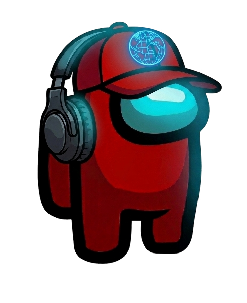

> This mod is not affiliated with Among Us or Innersloth LLC, and the content contained therein is not endorsed or otherwise sponsored by Innersloth LLC. Portions of the materials contained herein are property of Innersloth LLC. © Innersloth LLC.

> In the releases, there are BepInEx builds with AUModdedRegions included. BepInEx's [source code is available here](https://github.com/BepInEx/BepInEx) and it is not under MIT License like this project. It is under LGPL-v2.1

# RegionInstaller

  
   
   
  
  
  
  
  
  
  
  
  

RegionInstaller is a BepInEx plugin that removes Innersloth regions from Among Us and adds other regions that supports [modded handshake](https://github.com/NuclearPowered/Reactor.Impostor).

It adds the following regions (and the regions added manually in the config file):

- Niko233 (NA)
- Niko233 (EU)
- Niko233 (AS)
- Niko233 (CN)
- Modded EU
- Modded NA
- Modded AS

and removes these regions:
- North America
- Europe
- Asia

The modded regions are not managed by me. If you have a problem, contact the regions' owner.

Niko233 regions website: https://au.niko233.top

Modded EU, Modded AS and Modded NA regions doesn't have a website yet.

For more information, see [Informations](INFO.md).

For mod developers that want to integrate this plugin to their mods, you can. See [license here](LICENSE).

All of the listed regions use a custom, open-source server called [Impostor](https://github.com/Impostor/Impostor). You can host it yourself on a VPS, a [Raspberry Pi](https://raspberrypi.com) or an old laptop, and it is under GPL-v3.0 License.

(Niko233 servers are using a custom build of Impostor available [here](https://github.com/NikoCat233/Impostor))

To use BETA builds of this plugin, go to the [Actions](https://github.com/BetterUsProject/AUModdedRegions/actions) of this repository (sometimes, normal versions are also on Actions).
